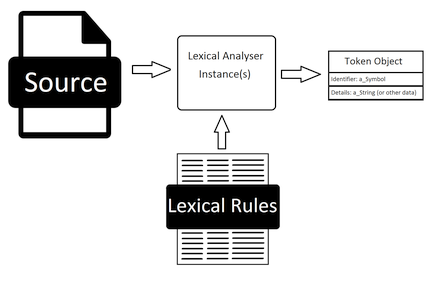

# LexicalAnalyzer

The lexical analyzer is a component of the Ruby Compiler Toolkit Project that
scans an input text against an array of rules and generating the lexical
tokens that it detects. This process is shown below:



The lexical analyzer is normally used in conjunction with a parse queue object
which handles queuing of tokens and back tracking of the compile process when
needed. In the rcpt this is done by the gem
[parse_queue](https://github.com/PeterCamilleri/parse_queue).

## Installation

Add this line to your application's Gemfile:

```ruby
gem 'lexical_analyzer'
```

And then execute:

    $ bundle

Or install it yourself as:

    $ gem install lexical_analyzer

## Usage

A lexical analyzer object is created with two keyword parameters, the text to
be analyzed and an array of rules for performing that task.

```ruby
lexical_analyser = LexicalAnalyzer.new(text: text, rules: rules)

token = lexical_analyser.get

```

It is sometimes desirable to reuse an existing lexical analyzer. This can be
done with the renew method.

```ruby
lexical_analyser.renew(text: new_text)

token = lexical_analyser.get

```

Note: The renew method takes the same arguments as the new method, text and an
array of rules. If these are omitted, the default is to leave that value
unchanged. The renew method returns the updated lexical analyzer just like the
new method returns the newly created one.

#### Rules

The rules are an array of LexicalRule objects. Each consists of a symbol, a
regular expression, and an optional action.

```ruby
# Rule with default block returns [:equality, "=="] on a match.
LexicalRule.new(:equality, /\A==/)

# Rule with block equivalent to the default.
LexicalRule.new(:lparen, /\A\(/) {|value| [symbol, value]}

# Rule with an ignore block, ignores matches.
LexicalRule.new(:spaces, /\A\s+/) {|_value| false }

# Rule with an integer block returns [:integer, an_integer] on a match.
LexicalRule.new(:integer, /\A\d+/) {|value| [symbol, value.to_i] }

# Rule with a block that expands of to a sub-rule. Returns the value of the
# lexical analyzer in the captured variable ka.
LexicalRule.new(:identifier, /\A[a-zA-Z_]\w*(?=\W|$|\z)/) {|value| ka.renew(text: value).get}
```

Notes:

* The regular expression must begin with a \A clause to ensure correct
operation of the analyzer.
* The order of rules is important. For example, if there are two rules
looking for "==" and "=" respectively, if the "=" is ahead of the "==" rule
in the array the "==" rule will never trigger and the analysis will be
incorrect.

#### Tokens

The output token is an array with two elements.

token[0] - the symbol extracted from the rule that generated this token.

token[1] - the text that generated this token or its value.


#### Example

The test file "lexical_analyzer_test.rb" has the method
test_some_lexical_analyzing that is a really good example of this gem in
action.

## Contributing

#### Plan A

1. Fork it ( https://github.com/PeterCamilleri/lexical_analyzer/fork )
2. Create your feature branch (`git checkout -b my-new-feature`)
3. Commit your changes (`git commit -am 'Add some feature'`)
4. Push to the branch (`git push origin my-new-feature`)
5. Create a new Pull Request

#### Plan B

Go to the GitHub repository and raise an
[issue](https://github.com/PeterCamilleri/lexical_analyzer/issues)
 calling attention to some
aspect that could use some TLC or a suggestion or an idea.

## License

The gem is available as open source under the terms of the
[MIT License](./LICENSE.txt).

## Code of Conduct

Everyone interacting in the LexicalAnalyzer project’s codebases, issue
trackers, chat rooms and mailing lists is expected to follow the
[code of conduct](./CODE_OF_CONDUCT.md).
